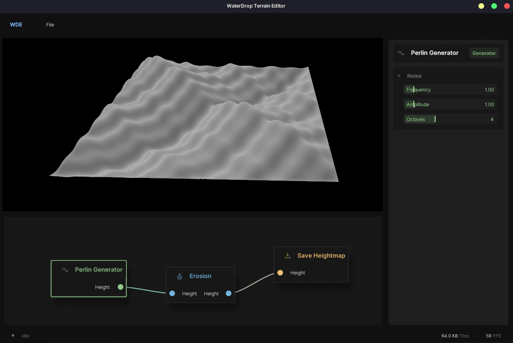

    

# WaterDropEngine

## Presentation
**WaterDropEngine** (<i>WDE</i>) is a 3D game engine in Rust.

As its name suggests, it is designed to be *small, simple and efficient*. It is also **my personal project**, so it is not intended to be used by other people, but rather to be a playground for me to learn and experiment with game engine development.

*Therefore, I do not intend to make it a full-featured engine, but rather to focus on the core features that I find interesting and useful for my own projects.
I will not take into account pull requests or issues from other people, but I will be happy to answer any questions or give any advice to anyone who wants to learn game engine development.*

## Demo
**[WaterDrop Terrain Editor](https://github.com/explorablescience/WaterDropTerrainEditor)** is a node-based terrain generation and erosion editor built on top of *WaterDropEngine*, and is the main project currently exercising it.

    

## Documentation
The documentation of the engine is available on the Github Pages of the project **[at this link](https://explorablescience.github.io/WaterDropEngine/wde/)**. It is generated using GitHub Actions, so it is automatically updated every time I push a new commit to the main branch.

## Dependencies
At its core, *WaterDropEngine* relies on:
- **[Bevy's ECS](https://bevyengine.org/)** for the Entity Component System.
- **[wgpu](https://wgpu.rs/)** for rendering, with a custom renderer built on top of it.
- **[Rapier](https://rapier.rs/)** for physics and simple ray casting.

## Running the engine
To start running *WaterDropEngine*, you will need to have Rust installed on your computer. If you don't have it, you can install it by following the instructions on the [official website](https://www.rust-lang.org/tools/install).

Then, you'll need to fork the project into your own GitHub account, clone the repository using `git clone https://github.com/explorablescience/WaterDropEngine.git`.

Once all of these is done, ***you are ready to start using WaterDropEngine!***
If you use `Visual Studio Code`, you can open the current repository by running `code .` in the terminal in the root of the project. Then a few configurations will be automatically generated for you. Mainly, you will have 3 configurations available in the "Run and Debug" tab:
- `Trace` to run in debug mode with tracing enabled. You can then download [Tracy](https://github.com/wolfpld/tracy) to visualize the traces. It is a very useful tool to understand the performance of your game and to identify bottlenecks but has a lot of overhead, so it is not recommended to use it for long periods of time.
- `Debug` to run in debug mode without tracing. This is the ***default configuration and is recommended for most of the development process***. It allows you to use the debugger and to have a good performance while developing your game.
- `Release` to publish the game in release mode.

